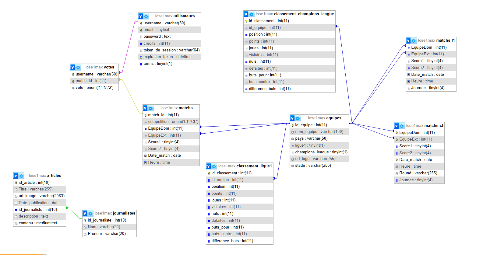

# Structure du projet

**Menu principal : [revenir à l'accueil](../../README.md)**

## 📋 **Liens**

### 🚀 *Structure de la base de données*

### Lien vers le canva :[ ici](https://www.canva.com/design/DAGncwvdKdI/LducqPO_0dYZdZx_B79oAQ/view) (zoom + déplacement)




### 🚀 *Intéractions avec la base de données (côté PHP)*

#### Fichier : Database.php

- Chargement de la base de données :

```PHP
public function load() {
    $servername = 'localhost';
    $username = 'root';
    $password = '';

    try {
        $this->bdd = new PDO("mysql:host=$servername;dbname=lose1max;charset=utf8", $username, $password);
        $this->bdd->setAttribute(PDO::ATTR_ERRMODE, PDO::ERRMODE_EXCEPTION);
    } 
    catch(PDOException $e){
        die("Erreur connexion : " . $e->getMessage());
    }
}
```

- Requête SQL simple

```PHP
public function request($requete) {
    try {
        $resultat = $this->bdd->query($requete);
        return $resultat->fetchAll(PDO::FETCH_ASSOC);
    } catch (PDOException $e) {
        die("Erreur dans la requête SQL : " . $e->getMessage());
    }
}
```

- Requêtes SQL préparée (avec et sans tableau)

```PHP
public function req_prepare($requete, $params = []) {
    try {
        $stmt = $this->bdd->prepare($requete);
        $stmt->execute($params);
        return $stmt->fetchAll(PDO::FETCH_ASSOC);
    } catch (PDOException $e) {
        die("Erreur dans la requête préparée : " . $e->getMessage());
    }
}

public function req_prepare_statement($requete, $params = []) {
    try {
        $stmt = $this->bdd->prepare($requete);
        $stmt->execute($params);
        return $stmt;
    } catch (PDOException $e) {
        die("Erreur dans la requête préparée : " . $e->getMessage());
    }
}
```